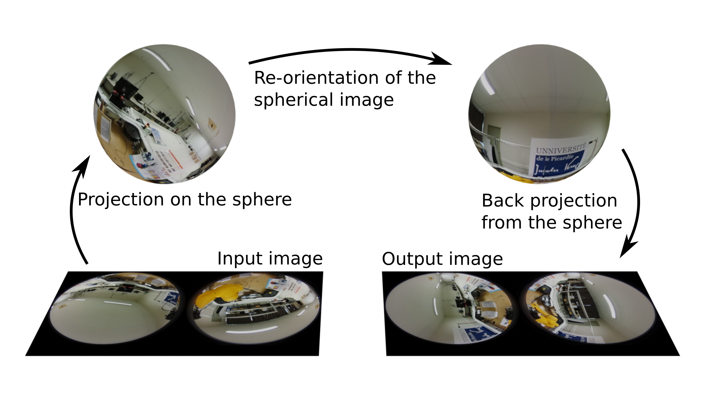

# Dual2dual

Warps a dual fisheye image to a sphere, transform it, then map back to the image plane as a dual fisheye image.



```
February 2023
Author: A. ANDRÉ
Contact: antoine.andre@cnrs.fr
```

## Prerequisities

0. CMake (version 3.16.3 tested)
1. ViSP (version 3.4.1 tested)
2. OpenCV (version 4 tested)
3. libPeR_base (version 0.0.3 tested, https://github.com/PerceptionRobotique/libPeR_base)

## Running the program

To run the program, just make the `launch_dual2dual.sh` executable with a `chmod a+x launch_dual2dual.sh` and run it from the command line.

Don't forget to adjust the parameters of the program before launching it.

## About the images

1. Download and unzip examples of dual fisheye images that are available here: https://home.mis.u-picardie.fr/~panoramis/


